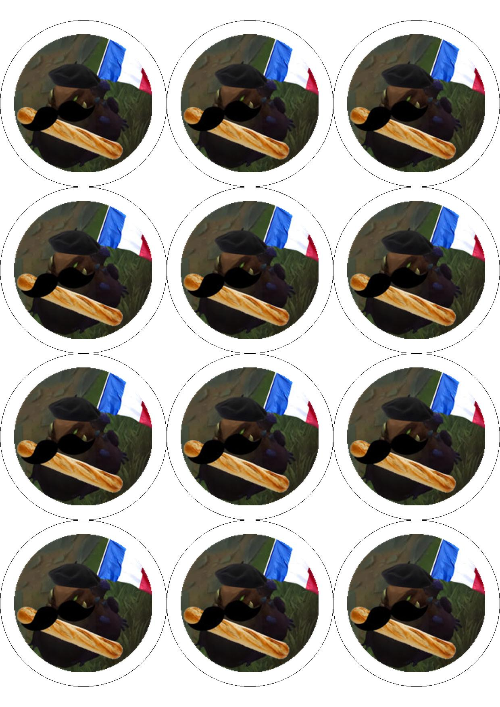

# Pin Layout Generator
This project creates a print-ready image containing a circular pins layout.

## Requirements
- Python 3.9 or higher
- Following Python libraries: (should install automatically when you run the script, but there is a chance that they won't)
    - Pillow
    - Numpy
    - Rich
    - Syhmac's Simple Logger (bundled)

## Features
- Automatically installs python dependencies.
- Automatically calculates image size based on the DPI.
- Creates a print-ready A4 sized image.
- Verifies that the image exists before processing.
- Allows the user to input custom DPI and pin sizes.
- Configurable via `config.json` file.
- Easy to use command-line interface.
- Two types of layout: grid and honeycomb.
  - Grid layout aligns pins in straight rows and columns, which doesn't lose any pins on the rows dividable by 2, but might leave no margins on the sides of the page, which may cause issues when printing.
  - Honeycomb is the default layout. It may allow you to fit an additional column of pins over the grid method and will leave bigger margins on the sides of the page, which may be better for printing.


## Installation
1. Clone the repository or download the entire project.
2. Copy `config.default` to `config.json` and adjust the default values if needed. You can skip this step if you want to use the default values.
Script will create a `config.json` file if it doesn't exist, but it will not overwrite an existing one.

## Updating
1. Pull the latest changes from the repository or download the latest version of the project.
2. If there are any changes to the `config.default` file, you need to copy those to your `config.json` file.
Alternatively you can delete your `config.json` file and run the script again, which will create a new `config.json`
file with default values. However, this will also reset any custom values you had in your `config.json` file,
so make sure to back it up before deleting it.

## Usage
1. Run the script from command prompt using `python __main__.py` command.
2. Follow the prompts to input the desired DPI, layout and pin size.
3. You will see a table with image ID, path and color. Choose the ID of the image you want to set for each pin. Once you set one of them
you can then choose different ID and input the ID of the pin that's already set to copy its properties. If you leave any
entry empty, the script will attempt to fill it, but the entry of ID 0 MUST be set.
4. Script will generate a `pins.jpg` file and exit.

If you encounter any issues, please check the troubleshooting section below or open an issue on GitHub.

### Example:
The runtime interaction with the script may differ because I'm not updating it every time I make a change, but it should be similar to this:
```
python __main__.py
Enter the target dpi. Leave blank to use the value from config.json

Enter the pin outer diameter in millimeters. Leave blank to use the value from config.json

Enter the pin inner diameter in millimeters. Leave blank to use the value from config.json

Page size: 1240x1753 pixels
Pin outer diameter: 413 pixels
Pin inner diameter: 342 pixels
Number of pins that can fit on the page: 12
You will be prompted to enter the path for images. If you leave any image set to None it will be filled with the details of the nearest previous image
WARNING: IMAGE OF ID 0 NEEDS TO BE SET. YOU CAN'T LEAVE IT EMPTY!!!
                       Images
┏━━━━┳━━━━━━━━━━━━┳━━━━━━━━━━━━━━┳━━━━━━━━━━━━━━━━━━┓
┃ ID ┃ Image Path ┃ Border Color ┃ Background Color ┃
┡━━━━╇━━━━━━━━━━━━╇━━━━━━━━━━━━━━╇━━━━━━━━━━━━━━━━━━┩
│ 0  │ None       │ None         │ None             │
│ 1  │ None       │ None         │ None             │
│ 2  │ None       │ None         │ None             │
│ 3  │ None       │ None         │ None             │
│ 4  │ None       │ None         │ None             │
│ 5  │ None       │ None         │ None             │
│ 6  │ None       │ None         │ None             │
│ 7  │ None       │ None         │ None             │
│ 8  │ None       │ None         │ None             │
│ 9  │ None       │ None         │ None             │
│ 10 │ None       │ None         │ None             │
│ 11 │ None       │ None         │ None             │
└────┴────────────┴──────────────┴──────────────────┘
Enter the ID of the image you want to set (or press Enter to finish):
0
Enter the path for image 0 or
Input the ID of already set image to copy its properties:
        pin.png
Enter the border color for image 0 (in hex format, e.g. #ff0000):
        #7B1FA2
Enter the background color for image 0 (in hex format, e.g. #ff0000):
        #BA68C8
                       Images
┏━━━━┳━━━━━━━━━━━━┳━━━━━━━━━━━━━━┳━━━━━━━━━━━━━━━━━━┓
┃ ID ┃ Image Path ┃ Border Color ┃ Background Color ┃
┡━━━━╇━━━━━━━━━━━━╇━━━━━━━━━━━━━━╇━━━━━━━━━━━━━━━━━━┩
│ 0  │ pin.png    │ #7B1FA2      │ #BA68C8          │
│ 1  │ None       │ None         │ None             │
│ 2  │ None       │ None         │ None             │
│ 3  │ None       │ None         │ None             │
│ 4  │ None       │ None         │ None             │
│ 5  │ None       │ None         │ None             │
│ 6  │ None       │ None         │ None             │
│ 7  │ None       │ None         │ None             │
│ 8  │ None       │ None         │ None             │
│ 9  │ None       │ None         │ None             │
│ 10 │ None       │ None         │ None             │
│ 11 │ None       │ None         │ None             │
└────┴────────────┴──────────────┴──────────────────┘
Enter the ID of the image you want to set (or press Enter to finish):

Some images were not set and has been filled automatically. Here's the final table
                       Images
┏━━━━┳━━━━━━━━━━━━┳━━━━━━━━━━━━━━┳━━━━━━━━━━━━━━━━━━┓
┃ ID ┃ Image Path ┃ Border Color ┃ Background Color ┃
┡━━━━╇━━━━━━━━━━━━╇━━━━━━━━━━━━━━╇━━━━━━━━━━━━━━━━━━┩
│ 0  │ pin.png    │ #7B1FA2      │ #BA68C8          │
│ 1  │ pin.png    │ #7B1FA2      │ #BA68C8          │
│ 2  │ pin.png    │ #7B1FA2      │ #BA68C8          │
│ 3  │ pin.png    │ #7B1FA2      │ #BA68C8          │
│ 4  │ pin.png    │ #7B1FA2      │ #BA68C8          │
│ 5  │ pin.png    │ #7B1FA2      │ #BA68C8          │
│ 6  │ pin.png    │ #7B1FA2      │ #BA68C8          │
│ 7  │ pin.png    │ #7B1FA2      │ #BA68C8          │
│ 8  │ pin.png    │ #7B1FA2      │ #BA68C8          │
│ 9  │ pin.png    │ #7B1FA2      │ #BA68C8          │
│ 10 │ pin.png    │ #7B1FA2      │ #BA68C8          │
│ 11 │ pin.png    │ #7B1FA2      │ #BA68C8          │
└────┴────────────┴──────────────┴──────────────────┘
```

This will result in:


## Printing
File `pins.jpg` is generated in A4 size with 300 DPI by default, which should be print-ready for most printers. However,
I advise to print the file using proper image viewing app, like `XnView` choosing the "Single - DPI" option in the print layout settings.
This will ensure that you won't get any additional margins added by the printer. Under no circumstances you should use
the default Windows printing options, because it will add margins and scale the image, which will result in incorrect pin layout.

## Troubleshooting
1. First thing you should try when something goes wrong is to check the log file that is generated in the `/logs` directory.
You will find information about the error - if it was expected. If program crashes without handling it properly, please
open an issue on GitHub, attach the log file and provide as much information as possible about the error and your system configuration.

2. Other thing you might want to try is deleting the `config.json` file and running the script again. This will create a new `config.json` file with default values.
If the error was caused by incorrect values in the `config.json` file, this should fix it.

3. Make sure that you're running the script from a command prompt. From what was reported to me it doesn't read the path
correctly when running it by double-clicking the `__main__.py` file.

4. If nothing works, please open an issue on GitHub, attach the log file and provide as much information as possible about the error and your system configuration.
I'll try to do my best to recreate the issue on my side and fix it.